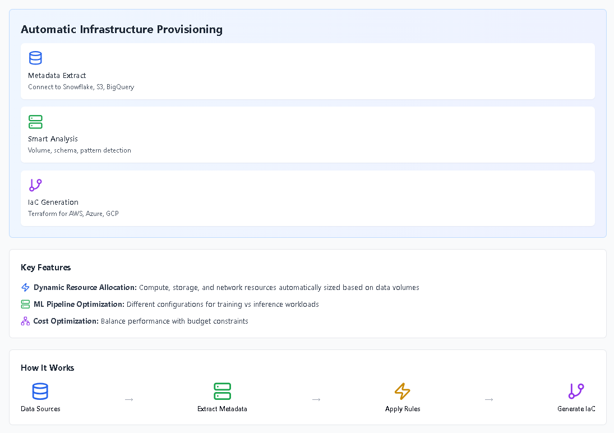

# Data-Aware IaC Templates MVP

## Overview
Dynamic Infrastructure as Code templates that automatically adjust based on data volumes, schema changes, and ML pipeline requirements.

## Features
- Metadata Extraction from data lakes/warehouses
- Dynamic Resource Allocation
- ML Pipeline Awareness
- Multi-Cloud Support (AWS, Azure, GCP)
- Cost Optimization
